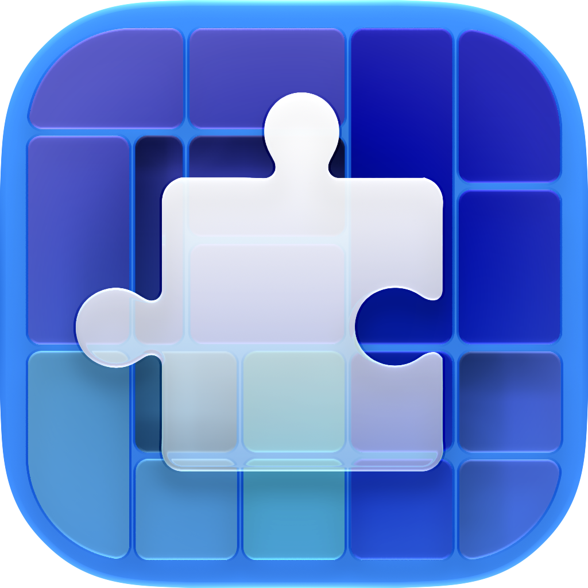

<h1 align="center">
    
  <p></p>
  <p align="center">GrandSniffer</p>
</h1>
<h3>
<p align="center"><i>GrandPerspective but Space Sniffer.</i></p>
</h3>

GrandSniffer is a macOS disk-usage visualizer derived from
[GrandPerspective][]. It keeps GrandPerspective's scanning and file-management
features while developing a more SpaceSniffer-like scanned-view interface.

GrandSniffer is an independent project and is not affiliated with or endorsed
by GrandPerspective or SpaceSniffer.

# License

This repository contains modified GrandPerspective source code, released under
the GNU General Public License version 2 or later. GrandPerspective's upstream
credits identify Erwin Bonsma as its developer, and the upstream application
identifies Eriban Software in its copyright notice. The original GPL notices,
copyright notices, and contributor credits are preserved in this repository
and in the application credits. GrandSniffer's changes are Copyright (C) 2026
Michael Y. Qiu and are distributed under the same license. See LICENSE for
details.

The complete corresponding source code and build project for GrandSniffer are
included in this repository. Binary distributions must be accompanied by the
corresponding source or by a GPLv2-compliant written offer, as required by the
license.

# Local development

GrandSniffer uses a shared build configuration so personal signing settings do
not need to be committed. To run a signed build from a fresh clone:

1. Copy `Config/LocalSigning.xcconfig.example` to `Config/LocalSigning.xcconfig`.
2. Replace `YOUR_TEAM_ID` with the Apple Developer Team ID used by Xcode.
3. Select the `GrandPerspective` scheme in Xcode and build or run the app.

`Config/LocalSigning.xcconfig` is ignored by Git. The project can also be built
without signing from the command line with:

```sh
xcodebuild -project GrandPerspective.xcodeproj -scheme GrandPerspective \
  -configuration Development -sdk macosx build CODE_SIGNING_ALLOWED=NO
```

# How to contribute

You can contribute in various ways:
- Submit [bug reports][]
- Submit [feature requests][]
- Provide [translations][]
- Get the word out by providing [reviews and recommendations][]
- Make a [donation][]
- Purchase it from the [App Store][]

For more information about the application, please visit the
[GrandPerspective website][].

[GrandPerspective website]: http://grandperspectiv.sourceforge.net
[GrandPerspective]: http://grandperspectiv.sourceforge.net
[bug reports]: https://sourceforge.net/p/grandperspectiv/bugs/
[feature requests]: https://sourceforge.net/p/grandperspectiv/feature-requests/
[translations]: https://grandperspectiv.sourceforge.net/#localization
[donation]: https://grandperspectiv.sourceforge.net/#donations
[reviews and recommendations]: https://grandperspectiv.sourceforge.net/#limelight
[App Store]: https://itunes.apple.com/us/app/grandperspective/id1111570163?mt=12
